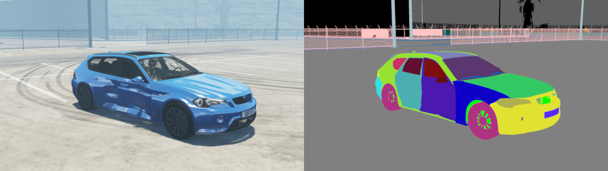

# Impact Data Generation

## About

This Python script utilizes [BeamNG.tech](https://beamng.tech/) and the
[BeamNGpy](https://github.com/BeamNG/BeamNGpy) library to generate various
vehicle impact scenarios and output surround views of the affected
vehicle in color and semantically annotated images. Additionally, the data
includes information about the node and beam structure of the vehicle
before and after the impact to allow assessment of damages. It was used
as part of a research project to generate training data.

All crashes include at least one vehicle, usually referred to as vehicle
A, and a possible other vehicle B being the second participant in a crash.
Each of these crashes randomly varies at least the weather, time of day,
color of the involved vehicles, and various parts of vehicle A. Namely,
these parts are:

 - Front bumper
 - Front bumper bar
 - Rear bumper
 - Left fender
 - Right fender
 - Hitch
 - Radiator
 - Hood
 - Roof
 - Wheels

The types of crashes are hardcoded, but also include randomized parameters. As
a special case, there is also the possibility of simply having no crash, which
produces output of the vehicle in an undamaged state, though weather, color,
and parts are still varied in this case. Possible crash scenarios include:

 - T-Bone:          Vehicle A is stationary and gets hit on the side by
                    vehicle B. In this scenario, the speed of B, the angle
                    of impact, and position of impact are varied randomly in
                    addition to the parameters listed above.
 - Rear end:        Vehicle A is stationary and gets hit in the rear by vehicle
                    B. Here, the speed of B, the angle of impact, and the
                    position of impact are varied randomly in addition to the
                    parameters listed above.
 - Frontal impact:  Vehicle A is stationary and gets hit in the front by
                    vehicle B. The speed of B, the angle of impact, and the
                    position of impact are varied randomly in addition to the
                    parameters listed above.
 - Pole crash:      Vehicle A drives into a pole. Here, the side that hits the
                    pole (front/rear), the speed of A, the angle of impact, and
                    the position of impact are varied randomly in addition to
                    the parameters listed above.
 - No crash:        Special case where no crash happens leading to imagery and
                    metadata of the vehicle in an undamaged state. Only the
                    parameters listed above are varied in this case as there is
                    no other vehicle and no impact.

All produced output is packaged into zip files. These files are named according
to the following convention:

`{unix timestamp}_{hash of scenario parameters}_{count}_{type}.zip`

Where `count` is simply an integer to increment in case there is another zip
with the same name and `type` is the type of images contained in the zip. This
can either be `image`, for regular color images, or `annotation` for annotated
images. Example zip names produced are:

 - `1568899113_81725586f3f4018d4d7c8e7f5fbc48_0_annotation.zip`
 - `1568899113_81725586f3f4018d4d7c8e7f5fbc48_0_image.zip`

## Setup

### BeamNG

This version of the tool works with BeamNG.tech and BeamNGpy. Table of compatibility of different versions of Impactgen is here:

| Impactgen version                                    | BeamNG.tech version | BeamNGpy version                                          |
| ---------------------------------------------------- | ------------------- | --------------------------------------------------------- |
| [1.2](https://github.com/BeamNG/impactgen/tree/v1.2) | >=0.35              | [1.32.0](https://github.com/BeamNG/BeamNGpy/tree/v1.32)   |
| [1.1](https://github.com/BeamNG/impactgen/tree/v1.1) | >=0.30              | [1.27.1](https://github.com/BeamNG/BeamNGpy/tree/v1.27.1) |
| [1.0](https://github.com/BeamNG/impactgen/tree/v1.0) | 0.21                | [1.19.1](https://github.com/BeamNG/BeamNGpy/tree/v1.19.1) |

Other versions of BeamNG.tech and BeamNGpy will not work with this version.

### Lua extensions

The required Lua extensions are located in the following paths in your BeamNG.tech installation folder:
- `\lua\vehicle\extensions\tech\impactgen\damageEvaluation.lua`
- `\lua\ge\extensions\tech\impactgen\crashOutput.lua`

### Python

This script requires at least Python 3.6. Since the library requires
ImageMagick's Python API [wand](https://docs.wand-py.org/en/0.6.6/index.html),
and `wand` on Windows requires extra steps for installation, make sure to
go through the necessary steps outlined in [wand's documentation](https://docs.wand-py.org/en/0.6.6/guide/install.html#install-imagemagick-on-windows)
first. Other dependencies can be pulled in using the following command:

`pip install .`

This also registers a new command for generation `impactgen`.

## Configuration

The behavior of this script can be changed using an external configuration file.
When the script is first launched, it generates such a file with default values
in the current working directory as `impactgen.yml`. In this file you will find
various settings regarding crashes and their output. They include:

- `imageWidth` - Width of each rendered image in pixels.
- `imageHeight` - Height of each rendered image in pixels.
- `colorFormat` - Format string of the color image sequence in zips.
- `annotFormat` - Format string of the annotation image sequence in zips.
- `cameraRadius` - Radius of the circle the surround camera flies around the
                   affected vehicle.
- `cameraHeight` - Height of the camera in meters. Note: The height is relative
                   to the center of the vehicle, hence the default value being
                   1.25 and not 1.8.
- `fov` - Field of View angle of rendered images. This affects how wide the
          "lens" of the camera is.
- `times` - List of daytimes to vary during data augmentation.
- `clouds` - List of cloud coverage values to vary during data augmentation.
             Note: On the smallgrid map, no clouds exist so this parameter is
             ignored. Only applies to West Coast USA.
- `fogs` - List of fog densities to vary during data augmentation.
           Note: On the smallgrid map, no clouds exist so this parameter is
           ignored. Only applies to West Coast USA.
- `colors` - List of vehicle colors to vary during data augmentation. This list
             contains sublists of RGBA values, where the alpha value determines
             the reflexivity of the vehicle.

Some additional configuration can be passed to the script at runtime, as
described in the following section.

## Usage

The main mode of operation for this script is for data generation. This can be
started using the command `impactgen generate`. At least two arguments are
required for this to work: A path to the copy of BeamNG.tech and a path to
the folder zips should be placed into. The path to BeamNG.tech needs to point
to the folder containing files like `startup.ini` — *not* the `Bin64` folder
which contains the actual binaries. An example invocation would be:

`impactgen generate D:\BeamNG.tech\ D:\data\`

A short overview of available parameters can also be obtained by running the script
with the `-h` or `--help` flag.

**Note**: The script makes no adjustments to BeamNG.tech's graphics
quality settings. To ensure maximum quality of the output, the user needs to
start BeamNG.tech manually and adjust settings according to their preferences.

## Background Variations

When launching the program with the `--smallgrid` option, data generation
takes place on an infinite flat plane. This allows for procedural variations of
the ground and sky textures, similar to research by [Tremblay et al.](https://arxiv.org/abs/1804.06516)
This does require some preparation, though, as there needs to be a batch of
textures available in the `smallgrid` level. These textures need to be in the
DDS image format and listed in a `json`-file the simulator understands. To this
end, this script offers a few utility commands that can convert common image
formats to DDS and generate a coresponding `json` file that lists textures
available for variations. These include:

`impactgen convert-materials <bng_home> <image_dir>`

This command converts all `.jpg`, `.png`, `.bmp`, `.gif` images in the
`<image_dir>` to DDS, places them in the level folder for `smallgrid` in
`<bng_home>` and generates a corresponding materials `json` file that informs
the simulator about the available materials.

`impactgen compute-similarity <bng_home> --threshold 70`

With this command one can precompute a similarity matrix that contains
[ORB](https://opencv24-python-tutorials.readthedocs.io/en/latest/py_tutorials/py_feature2d/py_orb/py_orb.html)-based
similarity scores. This matrix is used to avoid redundant variations of very
similar images.

Once materials are converted and a similarity matrix generated, generation on
`smallgrid` with random variations of sky and ground textures can be started
using:

`impactgen generate D:\BeamNG.tech\ D:\data\ --smallgrid --poolsize 16 --similarity 0.7`

These flags tell the program to load generation on the `smallgrid` map, pick 16
images whose similarity is below the given threshold, and goes through each pair
of those images for sky and ground material for each crash. Note this means the
amount of zips per crash generated is multiplied by `n^2`, where `n` is the given
pool size.

The project originally used the [Flickr8k](https://www.kaggle.com/adityajn105/flickr8k/activity)
dataset, but users are free to pick any set of images using the above commands.

## Output

Two zip archives per crash are saved into the specified output directory. Each
zip contains a series of images rendering a surround view of the vehicle after
the crash, with one zip containing regular color images and the other zip
corresponding semantic annotations. An example of both of these images can be
seen at the top of this document. In addition to the images, each archive also
contains several `json` files containing metadata. This includes:

- `parts.json` - Structured data about the vehicle's parts, most importantly the
                 corresponding color in the annotation
- `scenario.json` - Data about the scenario that produced the crash
- `objectAnnotation.json` - Information about each color in the semantic annotation
                            and what type of object it represents
- `partAnnotation.json` - Information about each color of vehicle parts and what
                          kind of part it represents

Archives also contain a mesh of the vehicle after the crash in the `GLTF` format.
This mesh file contains information about the vehicle's nodes and beams as well,
allowing inspection of its structure offline.
